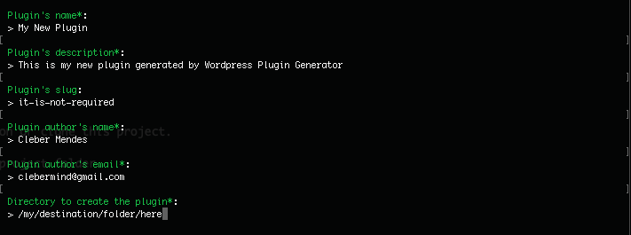

# Wordpress Plugin Generator

The Wordpress Plugin Generator lets you generate a MVC base files for a new Wordpress Plugin using the Terminal.
*IMPORTANT This project doesn't need Wordpress to run. It is not a PLUGIN, it creates a base files for a new Wordpress Plugin.*

## Getting Started

* Follow the plugin installation instructions below
* Follow the "How To" section bellow to generate new Wordpress Plugins

**Minimum Requirements**

* PHP version 5.6 or greater
* ZipArchive

### Installation

1. Download the latest plugin version or clone this project.

2. Open the terminal and go to the project folder.

3. Install composer dependence packages.
```
composer install
```
*or download it from and run*
```
php composer.phar install
```

4. Run the command bellow just to make sure the file has "execute mode permission".
```
chmod +x WPG
```

## How To

1. Open the terminal and go to the project folder.

2. Run the command bellow.
```
./WPG Plugin:Generator
```

3. You will be asked some questions about your new plugin to be generated. Answer and press enter for each one.


4. Enjoy your new Wordpress base files Plugin! =)

## Frequently Asked Questions

### How it works?
After you input your information it creates a new folder on the inputted directory so unzip the "lib/wordpress-plugin-base.zip" file which contains all base plugin files there. So, scan every file inside the new plugin folder and make replacements by defined tags per inputted information. Finally, download and run composer to install dependence packages and delete the composer.phar.

### "This file extension is different of the validated extension. Would you like to continue with this file?" What it means?
There's some default file extensions to have tags replaced by the entered information. This message means the file extension you can see above is not in a default range of these extension so you can choose to make replacement tags on this file or not.

### Can I change the default extensions?
For sure! Open the file *WordpressPluginGenerator.php* and include the extension you want on *private $validExtensions = ['php', 'json', 'tpl', 'css', 'js'];*.

### "This file size(XXXkb) is bigger than the limit(XXXkb). Would you like to continue with this file?" What it means?
There's a default limit size. When a file is bigger than this default size you can choose to make replacement tags on this file or not.

### Can I change the default limit file size?
For sure! Open the file *WordpressPluginGenerator.php* and change the limit to the number you want *private $fileSizeLimit = 1024; //kb*. Just keep in mind, this number is in KB!

### Why am I asked about limit file size and/or different file validated extension?
This is a security check to make sure everything goes right with the replacements and do not try to replace on a huge file if it doesn't need.

### I am not able to run, I am getting erros.
Make sure you have write permission on the plugin destination folder, you have ZipArchive installed, you are running PHP 5.6 or greater, the WPG file has "execute mode permission" and you have successfully run composer install.
If all of that is done and you are still having any problem, send me an email and I will try to help you!

### Can I change the Wordpress Base Plugin Files?
Yes you can! All you need is take your base files, replace variable content with "{{tags}}", zip that and replace the file *lib/wordpress-plugin-base.zip* by your new zip.
To see the {{tags}} it has open the file *WordpressPluginGenerator.php* and take a lok at the method *makeReplacements()*

## Built With

* [Symfony](https://symfony.com/) - Framework
* [Composer](https://getcomposer.org/) - Dependency Management
* [Bower](https://bower.io/) - Dependency Management

## Authors

* *Cleber Mendes* - (https://github.com/clebermind)

## License

This project is licensed under the MIT License - see the [LICENSE.md](LICENSE.md) file for details

## Acknowledgments

* PHP
* Composer
* Wordpress
